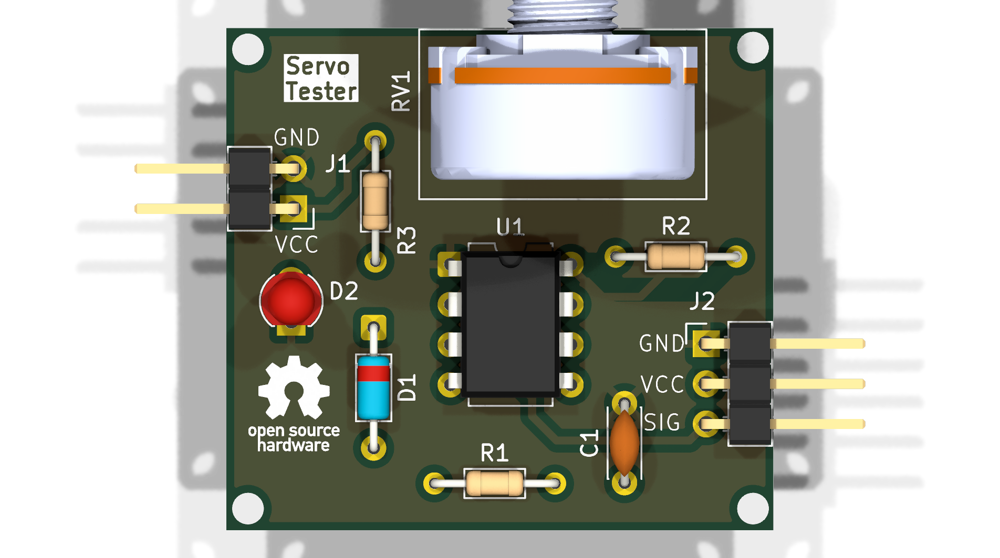
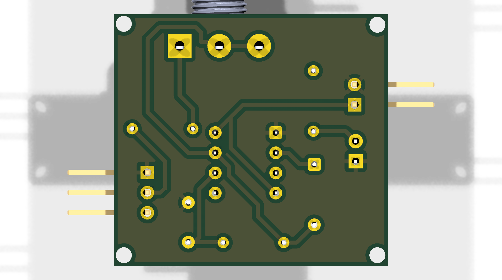

# Servo Tester

NE555-based servo motor tester: generates the ~50 Hz PWM control signal
that hobby servos expect, with a knob to sweep the servo position manually.
Power it from 5 V, plug a servo into the output header, and turn the pot.

## Features

- NE555 timer (U1, DIP-8) wired as an astable oscillator tuned for servo PWM
- 100 kΩ panel potentiometer (RV1) to control pulse width / servo angle
- Standard 3-pin servo header output (GND / VCC / SIG)
- 2-pin power input header (5 V / GND)
- Power LED indicator
- Compact ~35 × 32 mm board with mounting holes

## How it works

```
5V IN (J1) ──► NE555 ASTABLE (U1) ──► SIG ──► SERVO OUT (J2)
                      │    ▲
                 R1/R2/RV1  C1 22nF (timing network)
                      │
                 D1 1N4148 (steers charge/discharge for servo-friendly duty cycle)
```

1. The NE555 runs as an astable multivibrator at roughly 50 Hz.
2. RV1 varies the charge/discharge balance, sweeping the output pulse width
   across approximately the 1–2 ms range servos understand.
3. D1 separates the charge and discharge paths so the pulse width can be
   adjusted without shifting the frame rate too far.
4. The servo connects to J2 (GND / VCC / SIG) and follows the knob position.

## Bill of materials (BOM)

| Qty | Designator | Value | Part | Footprint | Notes |
|-----|------------|-------|------|-----------|-------|
| 1 | U1 | NE555P | 555 timer, DIP-8 | DIP-8_W7.62mm | The heart of the circuit |
| 1 | RV1 | 100 kΩ | Potentiometer, linear | Alps RK163 horizontal | Panel-mount knob — position control |
| 1 | R1 | 3.3 MΩ | Resistor, THT axial | Axial DIN0204 | Timing network |
| 1 | R2 | 56 kΩ | Resistor, THT axial | Axial DIN0204 | Timing network |
| 1 | R3 | 1 kΩ | Resistor, THT axial | Axial DIN0204 | LED series resistor |
| 1 | C1 | 22 nF | Ceramic disc capacitor | Disc D4.3 mm / P5 mm | Timing capacitor |
| 1 | D1 | 1N4148 | Small-signal diode | DO-35 | Charge/discharge steering |
| 1 | D2 | LED | 3 mm LED | LED_D3.0mm | Power indicator |
| 1 | J1 | 1×02 pin header | Power input (VCC/GND) | PinHeader_1x02_P2.54mm | Supply 5 V here |
| 1 | J2 | 1×03 pin header | Servo output (GND/VCC/SIG) | PinHeader_1x03_P2.54mm | Plug servo in here |

## PCB details

- Designed in **KiCad 10.0**
- Board outline: ~35 × 32 mm rectangle with mounting holes
- Files:
  - `Servo Tester.kicad_sch` — schematic
  - `Servo Tester.kicad_pcb` — layout (routed, single-sided)
  - `Servo Tester.kicad_pro` — project file
  - `docs/schematic.pdf` — schematic export
  - `docs/pcb-3d-top.png`, `docs/pcb-3d-bottom.png` — 3D renders

## Schematic

[Download schematic (PDF)](./docs/schematic.pdf)

## 3D preview




## Getting started

1. Open `Servo Tester.kicad_pro` in KiCad 10.0+.
2. Review/annotate the schematic, then run ERC until clean.
3. Review the PCB, run DRC until clean.
4. Export Gerbers + drill files and a PDF schematic for fabrication.

## Testing

1. **Visual check:** IC orientation (pin 1 dot), diode/LED/capacitor polarity.
2. **Power-up:** feed 5 V into J1, confirm the LED lights.
3. **Signal check:** with a multimeter or scope on SIG, turn RV1 end to end —
   pulse width should sweep roughly 1–2 ms at ~50 Hz.
4. **Servo check:** plug a small hobby servo into J2 (mind GND/VCC/SIG order)
   and confirm it follows the knob across its range.

## Status

- [x] Schematic captured
- [x] Footprints assigned, board outline + mounting holes placed
- [x] Design complete

Possible follow-ups:

- [ ] Fully annotate schematic
- [ ] Physical build & test
