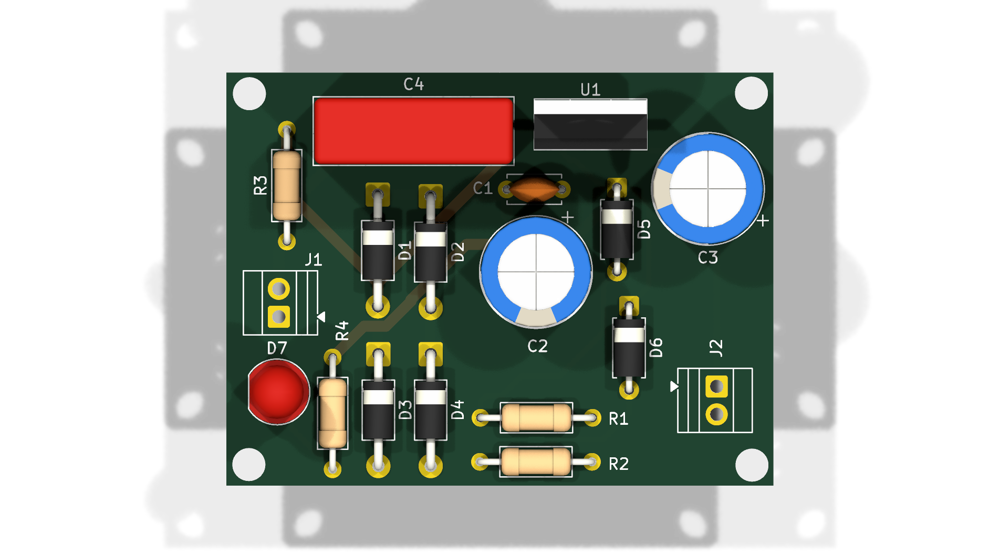
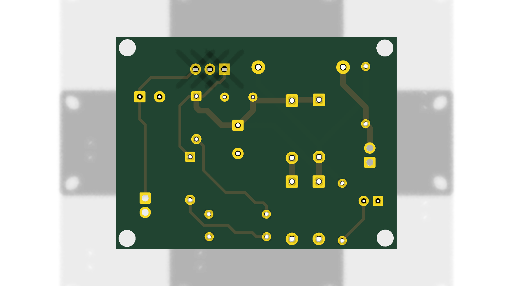

# Transformerless Power Supply

Transformerless (capacitive-dropper) 5 V power supply: AC mains → X-rated
dropper capacitor → bridge rectifier → filter → Zener clamp → LM7805
regulator → regulated 5 V DC output, with a power LED indicator.

> Folder name uses the original KiCad project name `Transforemerless power supply`.

## ⚠️ Safety warning — read first

This is a **non-isolated** supply: the entire circuit, including the 5 V
output, is live at mains potential and can injure or kill. There is no
transformer isolation. Only build and test this if you know exactly what
you are doing: use a fuse on the input, a proper enclosure with no exposed
conductors, correct creepage/clearance, and never probe it with grounded
test equipment (e.g. an oscilloscope) unless isolated. When in doubt, use
an isolated module or transformer-based design instead (see Project 01).

## Features

- Direct AC mains input via 2-pin screw terminal (no transformer)
- 2.25 µF film dropper capacitor (C4) to drop mains voltage without heat
- Bleed resistor (R3, 1 MΩ) across the dropper for safety discharge
- Full-wave bridge rectifier with 4 × 1N4007 diodes
- 1000 µF bulk filter capacitor (C2)
- Zener diode clamp stage (D5, D6)
- LM7805 linear regulator (U1, TO-220) for regulated 5 V output
- Output filter capacitors: 470 µF electrolytic (C3) + 0.1 µF ceramic (C1)
- Power LED with series resistor as a power-on indicator
- 2-pin screw terminal for 5 V DC output
- Compact ~50 × 38 mm board

## How it works

```
AC IN (J1) ──► C4 2.25µF dropper ──► BRIDGE (D1–D4, 1N4007) ──► C2 1000µF ──► ZENER CLAMP (D5, D6)
                                                                                    │
                                                                              U1 LM7805
                                                                                    │
                                          5V OUT (J2) ◄── C3 470µF + C1 0.1µF ◄─────┘
                                              │
                                        LED + R4 (indicator)
```

1. C4 acts as a lossless series impedance that drops most of the mains
   voltage; R1/R2 limit inrush current and R3 bleeds C4 when unplugged.
2. The bridge rectifies what remains and C2 smooths it into rough DC.
3. The Zener stage clamps the pre-regulator voltage to protect the 7805.
4. The LM7805 regulates down to a clean 5 V, with C3/C1 filtering the output.
5. The LED + R4 branch lights when the 5 V rail is present.

## Bill of materials (BOM)

| Qty | Designator | Value | Part | Footprint | Notes |
|-----|------------|-------|------|-----------|-------|
| 1 | C4 | 2.25 µF ("225K") | **X-rated film capacitor, mains rated (X2, ≥275 VAC)** | Rectangular L18 mm / P15 mm | Dropper — must be X-rated, never a plain DC cap |
| 1 | R3 | 1 MΩ | Resistor, THT axial | Axial DIN0207 | Bleeder across C4 — safety critical |
| 2 | R1, R2 | 20 kΩ | Resistor, THT axial | Axial DIN0207 | Inrush limiting — confirm power rating |
| 4 | D1–D4 | 1N4007 | Rectifier diode, 1 A / 1000 V | DO-41 | Bridge rectifier |
| 1 | C2 | 1000 µF | Aluminium electrolytic | Radial D10 mm / P5 mm | Bulk filter — verify voltage rating |
| 2 | D5, D6 | Zener | Zener diode — **confirm Zener voltage** | A-405 | Pre-regulator clamp |
| 1 | U1 | LM7805 | 5 V linear regulator | TO-220 vertical | Add heatsink if load current is high |
| 1 | C3 | 470 µF | Aluminium electrolytic | Radial D10 mm / P3.5 mm | Output filter |
| 1 | C1 | 0.1 µF | Ceramic disc | Disc D4.7 mm / P5 mm | Output decoupling, close to load |
| 1 | D7 | LED | 5 mm LED | LED_D5.0mm | Power indicator |
| 1 | R4 | 2.2 kΩ | Resistor, THT axial | Axial DIN0207 | LED series resistor |
| 2 | J1, J2 | Screw terminal 1×02 | 2-pin terminal block | Terminal block, P2.54 mm | AC in / 5 V out |

> The schematic still has a few unannotated symbols — run
> **Tools → Annotate Schematic** in KiCad and re-export the BOM before ordering parts.
> Also confirm the D5/D6 Zener voltages against your mains voltage and load current.

## PCB details

- Designed in **KiCad 10.0**
- Board outline: ~50 × 38 mm rectangle with mounting holes
- Files:
  - `Transforemerless power supply.kicad_sch` — schematic
  - `Transforemerless power supply.kicad_pcb` — layout (routed, single-sided)
  - `Transforemerless power supply.kicad_pro` — project file
  - `docs/schematic.pdf` — schematic export
  - `docs/pcb-3d-top.png`, `docs/pcb-3d-bottom.png` — 3D renders

## Schematic

[Download schematic (PDF)](./docs/schematic.pdf)

## 3D preview




## Getting started

1. Open `Transforemerless power supply.kicad_pro` in KiCad 10.0+.
2. Review/annotate the schematic, then run ERC until clean.
3. Review the PCB, run DRC until clean.
4. Export Gerbers + drill files and a PDF schematic for fabrication.

## Testing

1. **Do not skip the safety warning above.** Fuse the input, enclose the board.
2. **Visual check:** diode/Zener/LED/capacitor polarity and orientation.
3. **Power-up:** apply mains through an isolation transformer + variac if
   available, starting low; measure the 5 V rail with a multimeter.
4. **Load test:** apply the intended load, check regulation, ripple, and the
   temperature of R1/R2, the bridge, Zeners, and the 7805.

## Status

- [x] Schematic captured
- [x] Footprints assigned, board outline + mounting holes placed
- [x] Design complete

Possible follow-ups:

- [ ] Fully annotate schematic
- [ ] Export schematic PDF, 3D render, and Gerbers
- [ ] Physical build & test
